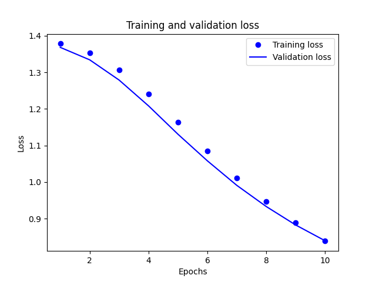
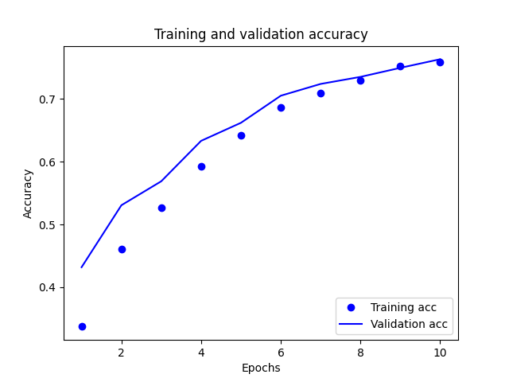

## 7/8/2021 Response
### Worked with Annabel Richter, Dylan Hartman, and John Willis.

1. "Provide plots that describe the training and validation loss and accuracy. Interpret the plots. How is this model performing?"
    - 
    - 
    - The model is performing well. It is promising that the validation accuracy is higher than the training accuracy. 
2. "Export the model and print the accuracy produced using the test data. Does the test data accuracy serve to validate your model?"
    - The test accuracy we got was 0.7327499985694885. This does validate our model because it is a relatively high score given the complexity of the task.
3. "Produce three examples that are relevant to the multi-class classification model and predicting the language relevant to the stack overflow question. Produce the array generated by each of your three examples. Were these predictions accurate?"
    - The results were somewhat accurate. Of the three examples we passed it, two were correctly identified.
4. "Compare your multi-class model with your binary class model that predicted sentiment as either positive or negative in response to various movie reviews. What is the most significant difference between the two different types of models? Compare the two models and estimate which demonstrated better performance? Substantiate your response."
    - The significant difference between the two models is that the first is strictly binary while the second is a classification of 4 different categories. Both sites allow for anyone to post on them. The accuracy of the binary model was 87%. This is significantly higher than the accuracy from the model predicting stack overflow, meaning that it is preforming better. 