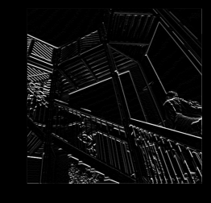

## Tuesday 7/13 - 7/14 

### Response to the Higgs Model
1. "Describe the dataset. What type of variable is the target? How many features are being used? How many observations are in the training dataset? How many are used in the validation set?"
    - The dataset is a series of observations regarding the Higgs Boson collider and the particles coming off of the collision between the two protons. The target variable is a binary value, 0 for it being not present and 1 for it being present. There are 28 features that we are using in the model. The training dataset has a total of 10,000 observations while the validation dataset has a total of 1,000. 
2. "How did each of the four models perform (tiny, small, medium and large)? Which of the four models performed the best? Which ones performed the worst? Why in your estimation did certain models perform better? Produce a plot that illustrates and compares all four models."
    - The 4 models did well. The model which preformed the best on the validation data was the small model. The best model on the training data was the large model. The medium and large model both did the worst on the validation data, while the tiny model did the worst on the training data. The two smaller models did better on the validation data because they were simpler models and did not get overfit on the training dataset. The two larger models did better on the training dataset because they are more complex with more layers, allowing it to understand the training dataset so well that they begin to even incorportate the noise of the training dataset into the model. This explains why they are overfit.
    
3. ¨Apply regularization, then add a drop out layer and finally combine both regularization with a dropout layer. Produce a plot that illustrates and compares all four models. Why in your estimation did certain models perform better?¨
    - The model which preformed the best was the combined model did the best of the models without becoming overfit. The model which did become overfit was the L2 model. The tiny model did good because it lacks overall complexity and therefore was unable to become overfit on the training data. Similarily, the L2 model was able to do well beacuse it has weight decay, meaning that the weights were forced to be smaller keeping it from extreme predictions. Lastly, the combined model did well because it takes the advantages of the dropout method and the L2 weight decay, resulting in the best predictions overall of the models.
    - 
4. "What is an overfit model? Why is it important to address it? What are four different ways we have addressed an overfit model thus far?"
    - Overfitting is when a model knows the training data too well, to the point that it begins to understand the noise of the training data and not just the underlying trends. This results in the model being much worse at predicting based on testing data, making it a poor model for new data. The model will be able to predict the training data perfectly, but not any new data that is presented to the model. Overfititng is important to address because overfit models have very little predictive power for new datasets that we want to introduce to it. One way to address overfitting is to decrease the complexity or parameters of a model. As well, you can add constraints to the weights to make them smaller values, making results closer to the mean. The third technique is dropping out certain layers randomly, making some nodes unresponsive to other nodes. Lastly, you can combine the weight decay and the dropout to create a combined model which can yield the best results.
    
### Convolutional Layers Response

1. "In this exercise you manually applied a 3x3 array as a filter to an image of two people ascending an outdoor staircase. Modify the existing filter and if needed the associated weight in order to apply your new filters to the image 3 times. Plot each result, upload them to your response, and describe how each filter transformed the existing image as it convolved through the original array and reduced the object size. What are you functionally accomplishing as you apply the filter to your original array? Why is the application of a convolving filter to an image useful for computer vision?"
   - The 1st filter was identifying horizontal lines. This means that it was convolving over the image and able to detect horizontal lines in the image and highight any. The second filter detects vertical lines in the same way that the first did for horizontal lines. Lastly, the third filter detects downward diagonal lines. This is because the 3x3 array has 1s in a di. Functionally applying an array filter multiplies its values with those in the picture's pixel values for each NxN section of the matrix, in this case 3x3. It then sums the value and puts them in a new, smaller matrix. This makes it so that the features around the desired object for detection are supressed and the object itself is left on its own. This convolving filter is helpful to computer vision because it is able to identify certain objects. The different convolving layers can add these objects together to make the full object that it is detecting.  
   - 1st Filter [ [-1, -2, -1], [0, 0, 0], [1, 2, 1]]
   
   
   - 2nd Filter [ [-1, 0, 1], [-2, 0, 2], [-1, 0, 1]]
   
   
   - 3rd Filter [[0,-1,-1],[1,0,-1],[1,1,0]]
   
   

2. "Another useful method is pooling. Apply a 2x2 filter to one of your convolved images, and plot the result. In effect what have you accomplished by applying this filter? Does there seem to be a logic (i.e. maximizing, averaging or minimizing values?) associated with the pooling filter provided in the example exercise (convolutions & pooling)? Did the resulting image increase in size or decrease? Why would this method be useful?"
   - By applying the pooling layer, you decrease the number of pixels in an image and it further exemplfiies the extracted features. It only keeps the largest values in a certain part of the matrix, meaning that that feature is represented over the other features. The logic behind the pooling filter in this example is to take the maximum values from each section of the matrix. The resulting image decreases in size. The method is useful for further showing the desired feature detected because their larger values are kept while the smaller values are decreased. As well, it decreases the size of the image which makes computations take less time and it removes unnecessary detail in the image. 
   - Pooling Image
   
   

   - The Resulting Matrix from the convolutional matrix exercise
   
   
