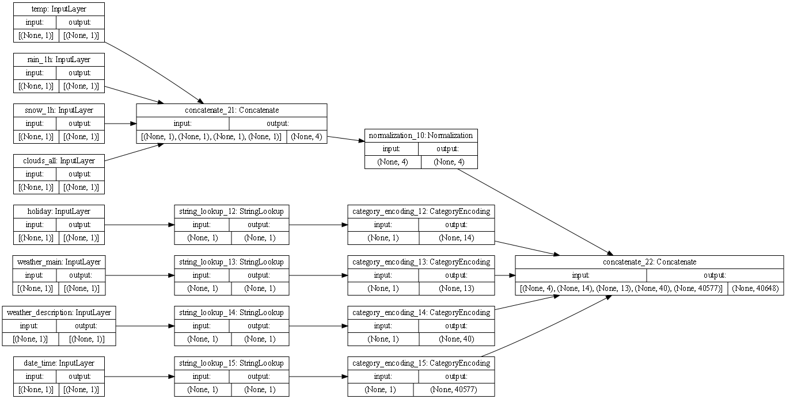
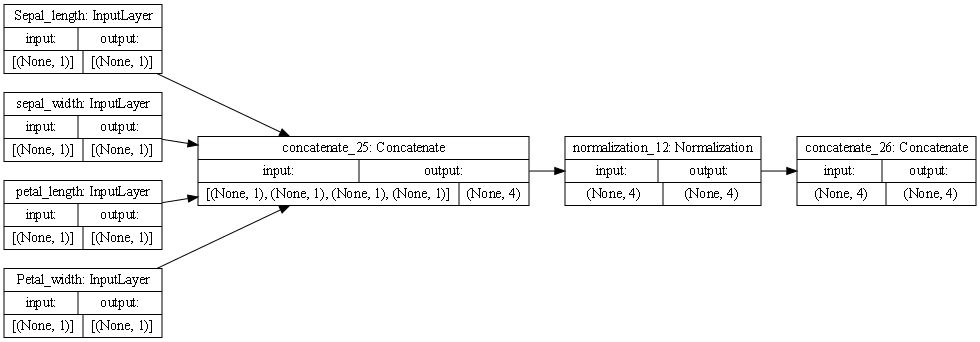

## 7/19/21 Response Traffic and Iris Dataset

### Describing the Plots of the Models

#### Traffic

- This is the model for the traffic dataset. The first couple blocks are the initial inputs, including the temperature, rain, snow, clouds_all, holiday, weather_main, weather_description, and date_time. The first four combined into a concatenation block. This puts the variables together. Below that, the last 4 variables got StringLookup, meaning that their string values were turned into indices with binary values. From here, the concatenation block was moved into a normalization block above. This means that the mean and variances were adjusted for the numerical values. The StringLookup blocks were changed into Category Encoding blocks. Finally, the four remaining blocks were put into a concatenation block as an output. 
#### Iris

- This is the model for the iris dataset. The first 4 boxes represents the inputs into the model. These include the Sepal_length, sepal_width, petal_length, and Petal_width. The next top box represents the Sepal_length, sepal_width, petal_length, and petal_width in a concatenated form. This is a transformation to make it easier to predict from the input. The next top layer is normalization, a type of standardization that makes the variances and means equal among the numerical values. Finally, there is the Concatenate block which takes all the inputs together, so it is fed into the model. This shows 1 total paths to the concatenation stage. This is a necessary step so that it can be one tensor to put into the model.

### Outputs from the Model
#### Traffic
- I was able to run the model once I changed the datatype of certain columns in the dataset from strings to floats and integers. The resulting loss was 3524826.5000. This means that the model is extremely poor at predicting the traffic volume. 
- The target for the traffic dataset is the traffic volume. This is a continuous variable that represents how much traffic there is. The output of the model is a prediction of what the traffic_volume is based on the other input features. This model uses a Mean Squared error loss function for the accuracy because it is assessing a continuous variable. This is looking at how far off the prediction is from the true continuous volume. 

#### Iris
- I ran the model first for classifying the species denoted by 2. The results were a loss of .3962. When I classified for 0, I got a loss of .2027. Lastly, for 1 I got a loss of .5957.   
- By some of the code in the beginning, we changed the problem from a Sparse Categorical problem into a binary classification problem. As such, we were able to use Binary Crossentropy as the loss function. This provides a probability that the inputs are of one class or another.  