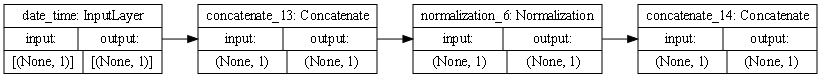
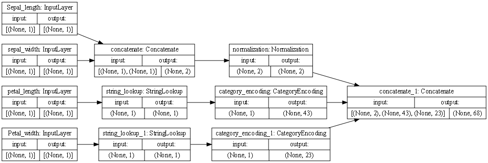

## 7/19/21 Response Traffic and Iris Dataset

### Describing the Plots of the Models

#### Traffic

- This is the model for the traffic dataset. It's currently not what I would expect since it is so linear and seems too simple. I was also struggling with the adapt section in the preprocessing as it continues to give me an error saying: "Function call stack: adapt_step". I've tried finding solutions but am currently unable to. Based on the given figure, it looks like the only initial input is the date_time feature. Form there, it is concatenated. This doesn't make much sense since it's only the one variable. After that, it is normalized. Again doesn't make a lot of sense to normalize a single variable and especially a time. Lastly, there is another concatenation step that puts the normalized values together. This is then fed into the model.
#### Iris

- This is the model for the iris dataset. The first 4 boxes represents the inputs into the model. These include the Sepal_length, sepal_width, petal_length, and Petal_width. The next top box represents the Sepal_length and sepal_width in a concatenated form. Below that is the petal_length transformed from a string to an integer indices as a vocabulary by the StringLookup transformation. This is a transformation to make it easier to predict from the input. The same StringLookup transformation was applied in the box below but to the Petal_width this time. The next top layer is normalization, a type of standardization that makes the variances and means equal among the numerical values. Below that is a block of Category Encoding for the transformed petal_length. This changes the indexes into a float32 type. This same transformation was applied to the petal_width in the box below. Finally, there is the Concatenate block which takes all the inputs from the three blocks in front of it together, so it is fed into the model. This shows 3 total paths to the concatenation stage. This is a necessary step so that it can be one tensor to put into the model.

### Outputs from the Model
#### Traffic
- I currently cannot get a result from the model because I am getting an error with the adapt section which I am currently unable to address.
- The target for the traffic dataset is the traffic volume. This is a continuous variable that represents how much traffic there is. The output of the model is a prediction of what the traffic_volume is based on the other input features. This model uses a Mean Squared error loss function for the accuracy because it is assessing a continuous variable. This is looking at how far off the prediction is from the true continuous volume. 

#### Iris
- I similarly cannot get a result for the iris dataset because I am getting an error saying ¨Function call stack:
  train_function¨ when I go to fit the model. I will continue to try to fix it but currently can´t figure it out. 
- The target for the iris dataset is the species represented by an integer from 1 to 3. This is as such a classification rather than a regression problem from above. For this reason the loss function of the model is a Sparse Categorical Cross Entropy. This is measuring what the predicted species is based on probabilities from 0 to 1 because of soft max applications. The output is an integer from 1 to N and corresponds to the species. 