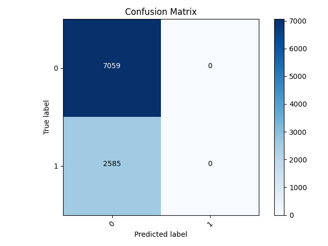
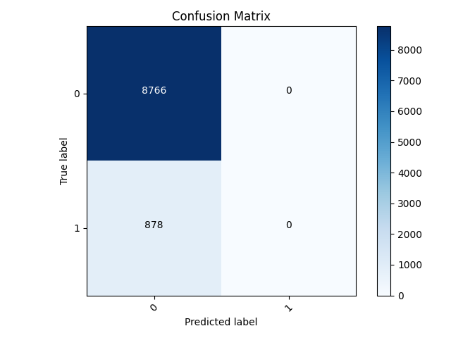
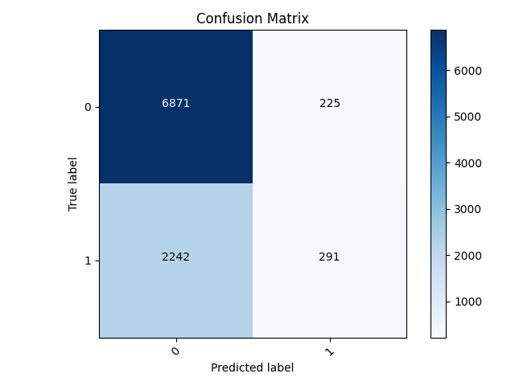
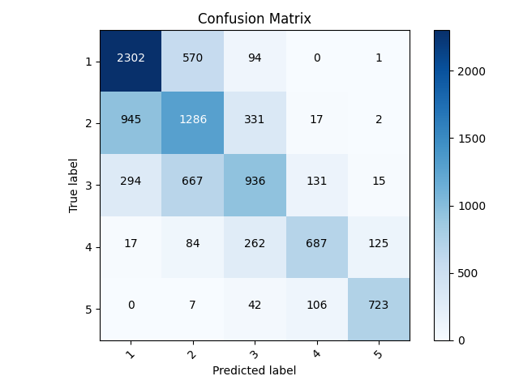
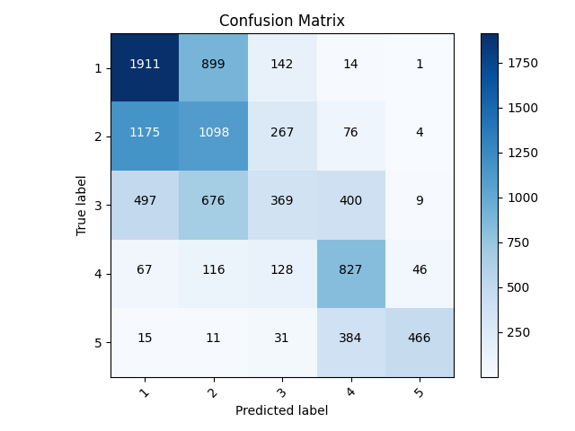

## 7/27/21 Project 3

### Binary Classification Solution
- For this project I used the feature columns script. I chose this dataset because of the ability to really customize the apporach and augment the variables in the exact way I wanted. With this, I started by loading in the country_persons csv file using pandas. I set this as an object called dataframe. Next I dropped any nan values. In order to make this a binary problem, I first set all 1's in the wealth class target as 1's and all other values as 0's. I continued this process each time I ran the model (ie. made 2's into 1's and the rest 0's for each wealth class value). I added these new values to a column entitled "target" which was separate from wealth. In total, I had to do this step 5 times, creating 5 distinct models. After setting up the binary target, I moved onto dropping certain features that didn't seem as helpful or easily implemented. Those features included the hhid, unit, pnmbr (person number), and weights. Additionally, I dropped the wealth column since I had the new "target" column. Once I had my dataframe set up, I moved onto setting up the training, testing, and validation sets. This was done through a simple train/test split function from sklearn. Next I changed the feature columns, starting with bucketized columns. The features I applied this process to were age and size. I had buckets for age from 10 to 70 with 10 years as increment [ie. 10, 20, 30...]. For size I had buckets of [5,6,9] because these were the 1st quartile, median, and 3rd quartile. After bucketizing, I set up categorical columns. The first was electricity, saying whether the individual had it or not. Next was car, having the same keys as electric. Last was gender which had keys of integers 1 and 2, 1 representing male and 2 representing female. Following the categorical columns, I had indicator columns for location, potable, toilet, and finally cook. Once I had my columns set up, I moved onto defining the actual model. There was 2 dense layers with 128 neurons, a dropout with a value of .1, and a final dense layer with 1 output. This 1 output is because it is a binary classification, so the output is either a 1 or 0.
- I was able to get results for each configuration of the binary problem (ie. 1's vs all, 2's vs all, etc.) The results I got for each are visible below. The best result was from the 5th model (5's vs all) and the worst was model 2 (2's vs all). This is a similar result of what I got last thursday. Upon inspection of the confusion matrices I produced below, it appears this is not a result of the predictive power of the features but rather a result of the size of the sample for each wealth class. The model is predicting that the label is "other" for every test datapoint. This means that it gets every datapoint that is a 1 incorrect. As such, if there are less of the 1's (5's in this case) the score will be higher. 5 has the smallest sample size of the wealth classes, meaning that it appears to have the highest accuracy in this model. Contrarily, wealth class 2 has the highest sample size in the test split, meaning the model gives the worst accuracy on it. For this reason, this model is currently unusable and we should look at using all of the targets at once, looking at a mutli class classification. Additionally, there is a chance that further alterations to this binary model can provide better results.

|Model Number| Score|
|-----|------|
| 1 | 0.7982 |
| 2 | 0.7259 |
| 3 | 0.7990 |
| 4 | 0.9101 |
| 5 | 0.9689 |

#### Worst Model Confusion Matrix (with only predicting 0)
- Below is the confusion matrix for model 2. The matrix exhibits the trend I mentioned above; the model only predicts 0. This means it will classify every test datapoint as a 0 regardless of changes in feature values. This means that 2 does poorly not because the features are unable of aiding a prediction for this class, but rather because it has the highest sample size. Because there are more values that are different than 0, 2's in this case, the accuracy is lower. This is another indication that we should maybe move away from the binary solution in this model.

#### Best Model Confusion Matrix (with only predicting 0)
- This is the confusion matrix for the best model: number 5. It exhibits the same trend I mentioned for the worst model. Because 5 has the smallest sample size, the model performs the best. There are fewer misclassifications because there are fewer values that are not 0.

### Changes to the binary model for improvements
- In hopes to improve the model, I did some data cleaning and more. First, I went through and dropped all missing values individually for electricity, car, gender, education, and age. I then moved onto aggregating the some of the values for toilet as well as potable (water). For the toilet, I had 3 columns. The first held the values of ['Flush to pit latrine', 'Flush to piped sewer system','Flush to somewhere else','Flush to septic tank', "Flush, don't know where"]. The second had the values of ['Ventilated Improved Pit latrine (VIP)', 'Pit latrine without slab/open pit', 'Pit latrine with slab']. Lastly, the third column had values of ['No facility/bush/field','99','Hanging toilet/latrine', 'Composting toilet','Bucket toilet','Other']. The hope with these aggregations is that it decreases the model complexity slightly, allowing for more accurate predictions. I did a similar technique for potable but with 5 columns. Column 1 had values of ['Piped into dwelling', 'Piped to yard/plot', 'Public tap/standpipe']. Column 2 had ['Tube well or borehole']. Column 3 had ['Protected well', 'Unprotected well']. Column 4 had ['Protected spring', 'Unprotected spring', 'River/dam/lake/ponds/stream/canal/irrigation channel', 'Rainwater']]. Lastly, column 5 had ['Tanker truck', 'Cart with small tank', 'Bottled water', 'Other', '99']. With these new aggregated columns, I had to change the feature columns slightly. Mainly, I removed toilet and potable from the indicator columns, instead making them categorical columns with keys that match the number of rows. I then ran the model, noting the new accuracies (seen below) and the matrices for the worst and best model. There was marginal improvement in the lower classes with a marginal decrease in the higher classes.

| Class | New Accuracy |
| ---- | ---- |
| 1 | 0.8055 |
| 2 | 0.7438 |
| 3 | 0.8018 |
| 4 | 0.9059 |
| 5 | 0.9629 |

#### Worst Model Confusion Matrix with alterations:
- The worst model was still class 2. The matrix shows that it was predicting for more than just 1, however it mispredicted 1 more often than not. This was fixed by making the predictions with probability above 0.5 1's, and below being 0's. With this additions, the modle is more applicable, but the low accuracy keeps it less useful.

#### Best Model Confusion Matrix with alterations:
- The best model was still class 5. The matrix below shows the overall good accuracy. With the fix I mentioned above with model 2, there were more predictions for label 1. This resulted in the higher accuracy.

### Multi Class Classification Model
- For the multi class classification model I used the same structure from the binary model while changing some values. I removed the process from the beginning of changing the wealth values to either a 0 or 1. By removing this line, I am maintaining the unique values for the wealth class target. This is the first step of a multi class classification task. I made a new column in the dataframe named target with the same values as the wealth column. I then dropped wealth from the dataframe. This made it so that the code below was consistent with the target labels. The next change came in describing the model. I changed the output dense layer to 6 instead of 1. I initally thought to change the value to 5 because this is how many wealth classes there are, but I recieved a warning saying that the bounds were exclusive (ie. [0,5)). In order to have it inclusive with the value of 5 for the wealth class, I upped it by 1 and set it as 6. Laslty, I modified the loss function. I changed it from the Binary Crossentropy that we used in the first model and set it as Sparse Categorical Crossentropy. This loss function accounts for multiple classes, exactly what we want. I then ran the model, noting the accurcay of __0.6154__. This is notably less than the binary model, but that can be deceiving. This model is predicting more than one value as seen in the confusion matrix below, making it much more useful for newer data. There are some modifications that can possibly add to its predictive power, which I will investigate further. Below is also a breakdown of correct and incorrect predictions as well as the accuracy. The accuracy was calculated by summing the amount of datapoints predicted as that label and then dividing that sum by the total correct labels.

| Label | Correct Predictions | Incorrect Predictions | Accuracy |
| ------- | ------ | ------- | ----- |
| 1 | 2302 | 1256 | 0.6470 |
| 2 | 1286 | 1328 | 0.4919 |
| 3 | 936 | 729 | 0.5622 |
| 4 | 687 | 254 | 0.7301 |
| 5 | 723 | 143 | 0.8348 |
#### Confusion Matrix

### Changes to the multiclass classification
- I did the same changes to the multiclass classification as I did to the binary. This includes dropping the missing values while aggregating labels for both the toilet and potable features. The changes I made seem to significantly decrease the accuracy I had gotten previously. With these changes, I got an accuracy of __0.4851__ compared to 0.6154 previously. The class the model predicted the worst was 2, followed closely by 3. The best predicted class by far was 5.

#### Confusion Matrix

| Label | Correct Predictions | Incorrect Predictions | Accuracy |
| ------- | ------ | -------| ----- |
| 1 | 1911 | 1754 | 0.5214 |
| 2 | 1098 | 1702 | 0.3921 |
| 3 | 369 | 568 | 0.3938 |
| 4 | 827 | 874 | 0.4862 |
| 5 | 466 | 60 | 0.8859 |
