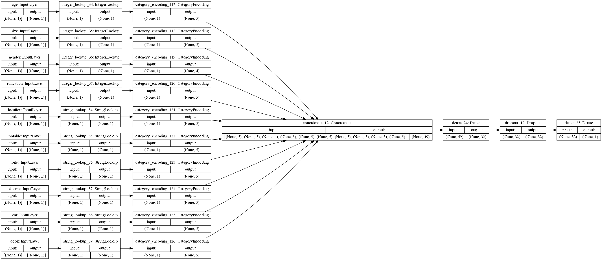
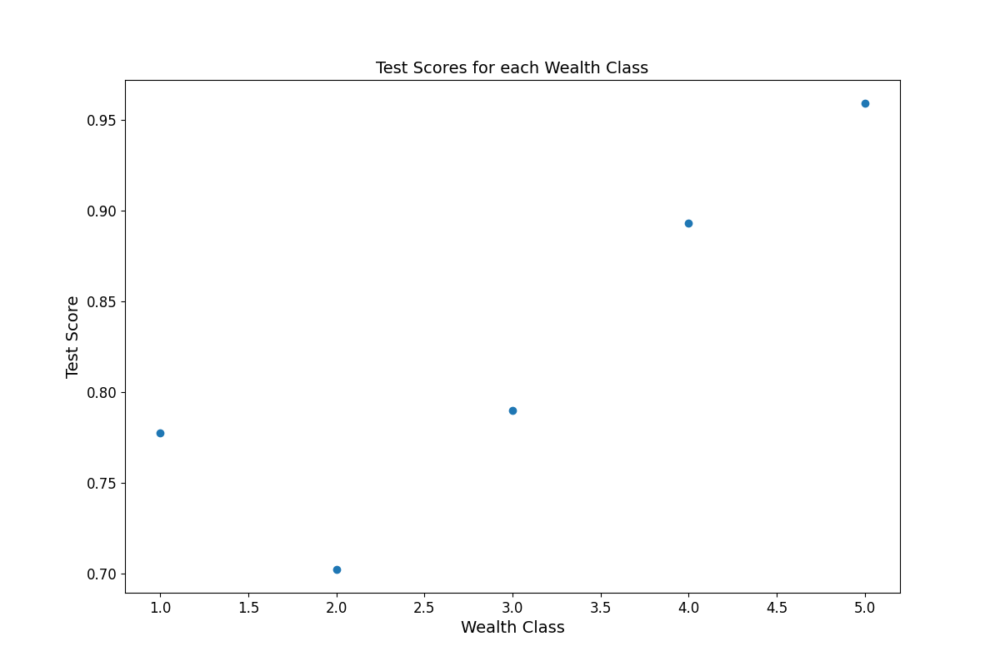

## 7/22/21 Response
### Link to Tao's Response: https://huatao-wm.github.io/data310/week3/thur3.html
### Building the Model:
- The dataset that we used for today was a demographic study in the country of Liberia. It involved a variety of features in order to predict the wealth class of a certain individual. I read the data in as a CSV file. From here I added a new column to the dataframe called "target" which had the values of the wealth column but with values which were 1 being 1 and all others being 0. This turned the problem from a multi-class classification to a binary classification. I repeated this process for the 5 wealth classes, training the model on each and testing their accuracy. I dropped the features of hhid, unit, pnmbr (person number), wealth (since this is our target), and weights. I split the dataframe into training, testing, and validaiton data with a 0.2 split. Moving onto the model I had a batch size of 256. I made numerical inputs from categorical inputs of age, size, and gender. These each were added to a tensor of these transformed interpretations of the data. Next, I made categorical values strings for the features of location, potable, toiler, electricity, car, and cook. These were also added to the new tensor. These were all concatenated and fed into the first layer. There was a dense layer with 32 neurons, followed by a dropout layer with 0.5, and finally a dense layer of 1 output. This is because it is a binary problem. Finally, I fit the model to the training data and validated it using the test data. I repeated this process for each wealth class, changing it to a 1 and the other wealth classes to 0's. The graphic below shows the structure of the model.

### Results and Trends:
- The results that I received from this dataset were different than what I got yesterday. With the previous dataset, we saw decreased model scores for predicting higher wealth classes but excellent scores when predicting the lower wealth classes. The model based on today's dataset had the opposite trend. It was middling at predicting lower wealth classes, hovering around the 70's for 1 and 2, but then jumping to the 90's for 4 and 5. It is possible that this opposite trend is because these variables are better at identifying higher wealth class trends similar to how it seemed like the previous features were better at predicting lower class trends. It seems possible that adding the additional variables in this dataset could help offset the discrepancy between the scores. Below is the a graphical representation of the scores. 

|Wealth Class| Accuracy|
|--------|------------|
|1 | 0.77737|
|2 | 0.702301|
|3 | 0.789817|
|4 | 0.892990|
|5 | 0.958938 |

