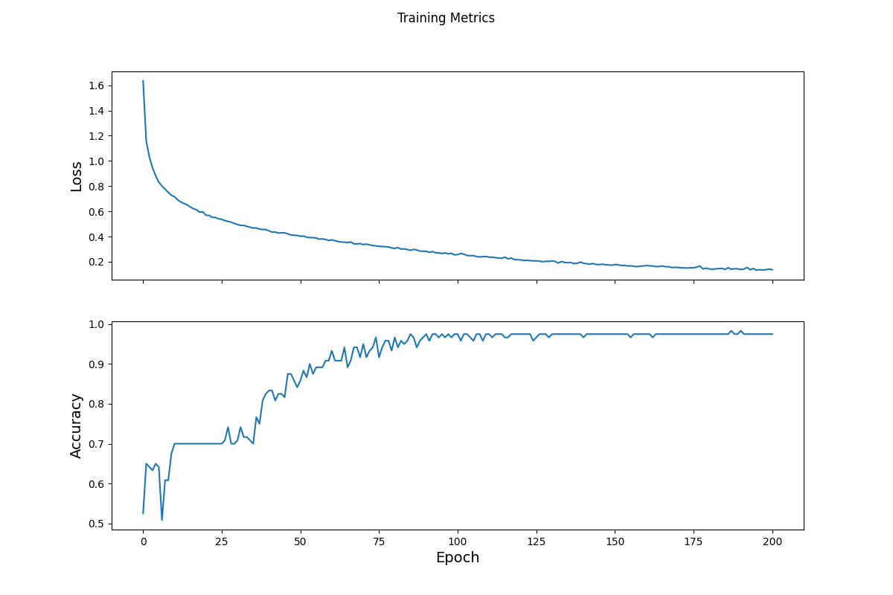

## 7/20/21 Response

### Describing the data used in the model
 - The data we used for the model was the famous Iris Dataset. This is comprised of various features which describe one of three species of flowers. The features include sepal length, sepal width, petal length, and petal width. These are all continuous variables. The target variable is the species of flower which is represented as a 0, 1, or 2. 0 indicated Iris Setosa, 1 for Iris versicolor, and 2 for Iris virginica. The tf.dataset was created by using the function tf.keras.util.get_file() along with the dataset URl. The data was processed using the tf.data.experiment.make_csv_dataset function. This had a batch size of 32 and as thus contained 32 observations. These were then turned into a combined tensor. 
### Describing the model
- The model architecture was created with 3 total dense layers. The first 2 had 10 neurons while the last had 3. The input shape was 4 because there are 4 total features. The output layer has 3 neurons because it is guessing from 3 different species. This means that it can pick one of those 3 species. The model was trained by defining the loss function as well as the gradient descent. From there, we ran a loop for 201 epochs to fit the model to the training data.
### Optimization and Loss of the Model
- The model uses a standard gradient descent optimizer. This looks for the best way to decrease the cost function. The graphical depiction of this is a series of peaks and valleys with a ball rolling to the deepest valley. This would be the lowest possible value that the cost function can reach. At this point, the model is most effective. The gradient descent needs to be more complex, however, because it is possible that the descent becomes stuck in a local minimum. The optimizer has a way to avoid this, searching instead for the global minimum. The loss function for the model is a Sparse Cross Entropy. This loss function is applicable becuase it is meant for categorical prediction with more than 2 possible outcomes. Because we are predicting between 3 different species, the sparse cross entropy loss function is most pertinent to the situation. The image below shows the loss change per epoch:

### Testing the Model
- We were able to test the model by importing an additional version of the Iris dataset which included more datapoints. This dataset has the same features and target representation, meaning we can use the same model from above to form predictions on it. We processed the data in the same way as with the training dataset, turning it into a tensor. We then fed the new testing data into the model and it returned a testing accuracy of 93%. The prediction is the argmax of the probabilities that the dataset represents a species of flower from the model. The argmax provides the index or indicator of which species it predicts. We were able to check single predictions by feeding a tensor of predictions one at a time into the model. This shows the effectiveness of the model on new data it's never seen. 
### My Testing of the Model and Results
- I tested the model with a tensor of results as such:
  
  [6.3, 4.2, 2.1, 0.8,],
  
  [5.2, 2.8, 3.9, 1.8,],
  
  [7.1, 2.9, 4.8, 1.9]

-  The results using these made up data points were interesting. It predicted with 98.6% certainty that the first was an Iris Setosa. It predicted that the second was a Iris Virginica with 68.1% certainty. Lastly, it predicted that the final input was an Iris Versicolor with 71.1%.
