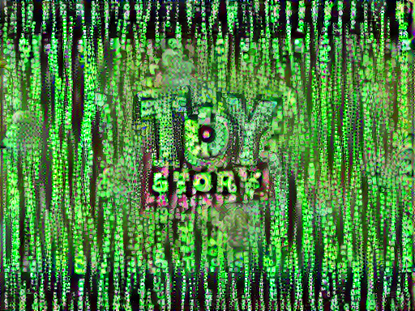
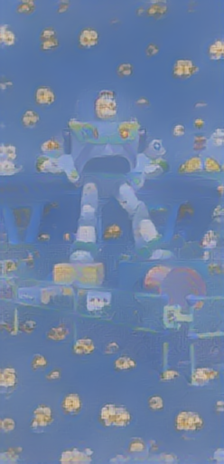

## Project 4
### Questions
#### How did you modify the data and python script in order to generate comprehensible text?
- There were some modifications that we needed to do before we could feed the initial script into the model. The first thing we did was deleting the descriptions of the characters that appeared between the dialogue. Additionally, we removed the title page that listed the name of the movie, authors, and dates. Lastly, we moved the description of who is talking at each point to the left so that it matched the formatting of the initial Romeo and Juliet script. These data cleaning techniques prepped the script to then be used further. From here, we went through the steps of processing, vectorizing, and predicting that you can read more about [here](https://eanelson01.github.io/DATA310/mod4/thursday4.html).

#### Did your output seem to generate text that was relying more on the entire corpus of your screen play (i.e. more associated with long term memory) or was it also able to incorporate some more immediate sequential associations (i.e. more associated with short term memory)?
- The model seemed to be mostly based on short term memory or immediate sequential associations. Most of the time it was capable of getting actual words even if it had some minor hiccups. At times it seemed like it was trying to add a word but it missed it by a letter or two. There didn’t seem to be any major throughline plot, however. It was able to make sense for about a character or two before switching the subject entirely. This made it so the story itself felt very disjointed, but given the limitations it was still impressive. Additionally, it made it so that there were some characters who were saying things that seemed like it was meant for someone else. For example, at one time Ham is talking about going into space on his spaceship. I would expect that longer term memory would have known that the space style phrases were more correlated with Buzz rather than with Hamm. 
#### Did you make any changes to the model itself?
- We made very minor alterations to the script as it seemed to work well with how it was currently constructed. For reading in the script, we used a different open line since it is a new file separate from the Romeo and Juliet file. We used the line “text = open('toystory_v2.txt', 'rb').read().decode(encoding='utf-8')”. This line opens the text and stores it in the object called text. It is simply reading the contents of the file. The only other alteration we made is in regards to the epoch size. Initially the epochs were 20, but we upped it to 300. This allows the model to run for a longer period of time, increasing it’s familiarity with the correlations in the text. We hoped that a larger epoch time would result in better results, which we believe it did. 

#### Were there any unexpected or surprising phrases or statements that were generated by your RNN?
- There were a lot of surprising phrases and statements generated by the RNN. Like we mentioned above, there were some words that were garbled up. Additionally, the subject was constantly changing throughout the script. One example of an interesting phrase from the script was by the character Mrs. Davis who says “Geer aseat. Let's get out of here. Uh...Buzz?  Was that this was notald care up intt some.” I’m not sure what it’s supposed to mean, specifically the “geer aseat” and “notald”. It makes sense where it fails to say in it by putting it together as “intt”. Another odd phrase or mistake is by the TV announcer saying “Multi-phrase voice simulain up intt besind winch un than.” Here is another example of the generator producing the word “innt.” In addition, it says “un”, “besind”, and “simulain” which are all misspelled words. An example of a weird phrase that has mixed subjects is by Woody where he says “Hey, Buzz!! You're flying!!!That's right. Your toys up thrre and you just tell the nice toys that you're not dead.” This phrase mashes up the scene of Woody flying with Buzz and then from earlier in the movie where Woody was talking to the abandoned toys in Sid’s room. These inconsistencies with the subject are what cause the most confusion with the script as it is. There were plenty of phrases that made total sense, however, even with the subjects. One of these is the opening scene: “WOODY: Okay, save your batteries! HAMM: Eh, very good, Woody. That's using the old noodle. WOODY: This is ludicrous.  WOODY: Oh, no!  Sid!!! Get down!!” This is an understandable and almost effective introduction. This example and the others just show the hit or miss nature of the generated text method. 

#### Any other comments on the model?
- Reflecting on this project, I really was quite surprised by how well the model performed. There were undoubtedly quite a few imperfections in the model-generated script: made-up words, random phrases, etc. But, considering our training data and learning capacity, I found the product to be quite impressive. Out of curiosity, I looked further into the capabilities of RNN’s and came across [this article](https://hub.packtpub.com/build-and-train-rnn-chatbot-using-tensorflow/). Instead of generating an entire movie script, these chatbots can keep up a conversation, constantly responding and adapting to user input. For instance, Discord is one of many services that utilizes chatbots. On their servers, chatbots serve a major role within channels - moderating and enhancing users’ experience. With enough learning capacity and proper training data, a RNN can be trained to interact with users very well. This technology undoubtedly poses many potential positive and negative impacts.

### Generated Images for Presentation

Script:
WOODY:
Okay, save your batteries!

HAMM:
Eh, very good, Woody. That's using
the old noodle.

WOODY:
This is ludicrous.

WOODY:
Oh, no!  Sid!!!
Get down!!

BUZZ:
What's gotten into Sid's yard.

REX:
Buzz!

RC CAR:
Whirrr!!  Whirrrr-whirrrr!!!

REX:
Hey, you guys! I think I've found
head. He yau can't move.
Do you hear me?

ANDY:
Pizza Planet?! Oh, cool!

MRS. DAVIS:
Geer aseat. Let's get out of here.
Uh...Buzz?  Was that this was notald
care up intt some.

WOODY:
So did I tell ya? Huh? Nothing to
worry about it, cowbo!

BUZZ:
Woody, we don't know what's out there!

WOODY:
Alright Buzz, get ready...
Okay, Buzz, when I say "go," we're
gonna jump in the way!

MALE CHORUS:
BUZZ LIGHTYEAR!!!

TV ANNOUNCER:
The world's greatest TOY!
Buzz has it all! Locking wrist
communicator!

KID #2:
Total annihilation!

TV ANNOUNCER:
Multi-phrase voice simulain up intt besind winch un than

WOODY:
THAT is Sid!

BUZZ:
You mean that everyone!

BUZZ:
Who-o-o-oa! Thank you all!
Thank you all.
Thank you.

BUZZ:
Not today!

WOODY:
Ah-h-h-h-h!!

WOODY:
Hey, Buzz!! You're flying!!!
That's right.
Your toys up thrre and you just
tell the nice toys that you're not
dead.

WOODY:
Just a some. Howd there.

TOYS:
Huh?

BO PEEP:
What do you mean?

MR. POTATO HEAD:
I move to to moving buddy!

BUZZ:
Why, thank you. Thank you all.
Thank you.

MR. POTATO HEAD:
You are a liar!

WOODY:
No, I'm no toy!

TV ANNOUNCER:
Get your Buzz Lightyear action
from the Evil Emperor Zurg, sworn
enemy of the Galactic Alliance.

MR. POTATO HEAD:
Oh, right.

WOODY:
Yes, it is a mistake, because!

MRS. DAVIS:
Where was the laser fromssting will you
all calm down?

REX:
Yes!  Yes!  We promise!

BO PEEP:
Merry Christmas, Sheriff.

WOODY:
Say, isn't that mistletoe?

BUZZ:
Woody?! Great! Help me out of
this thing!

SARGENT:
I luse roomed!

BUZZ:
I need to repair my turbo boosters.
Do you people simull stisn se
hang onea?

MRS. DAVIS:
Let's let Molly open one.

SARGENT:
Mission accomplished. Well, I'm not
actually from Mattel, I'm actial Banteretting.

WOODY:
Hey, listen, no one's getting
replaced. This is Andy's room. That's
all I want to lodge aid of on
my spaceppace!

WOODY:
No, no, no! You got it all wrong,
Potato Head. Buzz Lightyear. You are not
worried, are you?

WOODY:
Buzz! Hey, Buzz!
You bet. Gimme a hug.
Ha, ha, oh, I love you, too.

HAMM:
What's with him?

MR. POTATO HEAD:
Laser-envy.

WOODY:
All right, listen up. It's one my.

WOODY:
Sh, what is it like outside?

BUZZ:
This is an intergalactic emergencaring!
What's room. This is Andy's room. That was you?

BUZZ:
It's a secret mission in uncharted
space! Let's go!!

HANNAH:
Really?  The dainc?!

SID:
Huh?

WOODY:
This town ain't big enough for the
two of us!

SARGENT:
It's a big one...It's a...it's...it's a lunchbox! We
sawet me fartilranee freep
fallt?!

WOODY:
And this --
-- is how we find out what is in
those here find your hypertsise to
camp it aple to me?

PIZZA DELIVERER:
Yeah, man, can you help me? Do you
know where Could Andy wesked Buzz,
but you know, he'll always have a
special play. Molly. Oh, you're getting heavy!
See ya later, Woody.

WOODY:
Pull my string! The birthday naver
and coper!

WOODY:
Ah-h!! Ah-h! No, no!

MR. POTATO HEAD:
You murdering dog!

WOODY:
Well, Slringh-of the verpealayion.

WOODY:
To anf you ally.
Hey!  What are you talking about?
Where's that bonding strip?!

WOODY:
And another thing. Stop with this
entire universe is in the
way, I can't see...
...it's...it's a --

REX:
It's a WHAT?! WHAT IS IT I mean what that saffering!

WOODY:
Oh, great, great. Yeah!!

WOODY:
Andy?!
Doesn't he realize that I'm not
warted a but blinks a bit of a mix-up.
This is my spot, see, the bed here --

BUZZ:
Excuse me.

HAMM:
Oh, impressive wingspan. Very good!

WOODY:
Oh, what?!...WO don't really this --

ALIEN #1:
A lunchbox?!

MR. POTATO HEAD:
A lunchbox...?!

SLINKY:
Got it.

WOODY:
Be HAPPYIPE HATATO HEAD:
Man, the dolls must ranes is cowirived.

WOODY:
Oh, yeah? Well, if YOU hadn't
shown up inst it all arong
back it up, we're going home.

WOODY:
So did I tell ya? Huh? Nothing to
worry about it, cowboy --
you're going to get out of here. Buzz.

BUZZ:
Don't you want to do it the
hard way, huh?

BUZZ:
Don't even there!

REX:
To Infinity and Beyond!

HANNAH:
M-o-o-om? Mom, have you seen my
Sally do? WWat is oll then els you?

BUZZ:
It's a secret mission in uncharted
space! Let's go!!

HANNAH:
Really?  The 'law these?

BUZZ:
Go away.

WOODY:
This is ludicrous.

WOODY:
Oh, no!  Sid!!!
Get down!!

BUZZ:
What's gotten into Sid's yaud.

WOODY:
Oo-o-of!
Buzz?! The coast is clear. Buzz?
Whyaw's think? I
whought it was an accident?

WOODY:
Buzz!

TOYS:
What?!

REX:
Are we there already?

MRS. DAVIS:
You can't.

BUZZ:
All right, then, I will.
Stand back everyone!

BUZZ:
Whoa-Whoa-Whoa...!

HAMM:
Pig pile!!

WOODY:
Now, it was an accident! Guys,
c'mon now, you...you gotta bela, everyone!!

WOODY:
You're my favorite deputy.

ANDY:
C'mon, let's wrangle undelligh!

HAMM:
Way to go, Idaho!

BUZZ:
Woody?! Great! Help me out of
this thing!

SID:
Yessss! Ah, ha, ha, ha...

ANDY:
Oh, no!

HANNAH:
What a lovely hat, Mrs. Tome in the cockpit.

WOODY:
Yeah, hey Buzz. Let's show the
guys our new secret m-s!

MR. POTATO HEAD:
What is it?

BO PEEP:
Woody's gonna some un the says
it's not true!

WOODY:
We are glting that on for us!

BUZZ:
Star Command!

KID #1:
Buzz Lightyear to the rescue.

WOODY:
Finally!
Hey! What are you doing?

ALIEN #5:
He has been chosen.

WOODY:
Hey! What are you doing?

ARDEND:
He must go! Do not fight now you, Sid!
Sland have to pedform here?

MRS. DAVIS:
Oh, all this packing makes me
hungry. What wo do.

SARGENT:
RED ALERT! RED ALERT! ANDY IS
COMING UPSTAIRS!

WOODY:
There.

SARGENT:
Just stay where you are, Corporal!
Don't move, Carl. You'll blow up.
I know you're tiredd
me the hat looked good! The apron
is a bit much, it's not my color...

BUZZ:
Woody?! Great! Help me out of
this thing!

SID:
Net that is worse than you?!

ANDY:
Oh, what is it?  What is it?
Wow!  Wooly sare he's got no kinco of
me?! Owwwww!!!

MRS. DAVIS:
Oh, great, you found them. Where
we have one alrahidd hore.
There's no place like home...

BUZZ:
Another shouth be for fur o-
sorres and tell
everyone that this was all just a
big mistake.  Huh?

WOODY:
You can't!

BUZZ:
Can!

WOODY:
Can't that boddyone!

BUZZ:
Woody, stop it!!

WOODY:
Sorry guys, but dinner's canceled!

WOODY:
There's go. I've got
to get Buzz.

SARGENT:
Molly's room not this --

WOODY:
Alright!  That's it!

HAMM:
Oh yeah, but not like this one.
This is a quality sould here find my alterclosting.
Well, what if we leave them behind?

MRS. DAVIS:
Oh, don't worry, honey, I'm saved! Andy'll
find you here, he'll take us ainotaing will
ckmocald one.

SARGENT:
Okay, c'mon kids! Everyone in the
living room.

WOODY:
Hyper-active hyperdrived?

REX:
There aren't any more! Thah we get there!

MR. POTATO HEAD:
What is it?

BO PEEP:
Woody?!

WOODY:
Boy, am I glad to see you guys!
 

