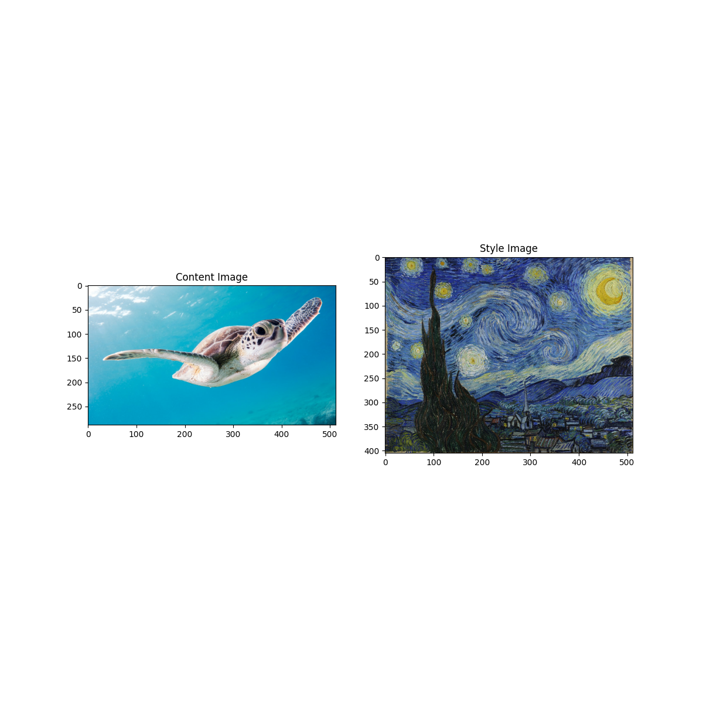

## 07/28/21 Response Images

### First Images
- For the first image of this project I decided to go with a sea turtle mashed with the Starry Night painting. I chose the turtle because they are my favorite animal and I chose starry night because I thought the blue aesthetic would nicely match the turtle. The first image below shows what the two look like on their own. Next is the gradients found for the turtle by the code. Last is the actual image the code produced.

- Reflecting on this image, I would say that it is representative of the calmer side of the jump start program. Although there has been a lot of work in such a short amount of time, it has felt like we're just surrounded in useful knowledge, just gliding through it. This image captures that wonder and allure of being surrounded by brilliant minds and ideas, soaking up all the knowledge we can in such a short amount of time. These experiences will be what I remember from the program rather than whatever acute stress it may have caused. 

### Second Images
- For my second go around I chose an image of a panda and an abstract blue artwork. I chose the panda because it's my second favorite animal, very creative I know. The artwork is just an image I found by looking up "blue abstract art" because I wanted the blue throughline with the other image. The outputs are in the same order as before: normal images, gradients, and combined image. 

- Reflecting on this image, it's representative of the exhaustion following a tough week of assignments. The panda's slumped position exhibits the feeling of near collapse after you spend so much time on assignments for each class. I imagine that following the final week of the program, including a final speech, final essay and exam for Philosophy, and the final project for this class I will be in a similar position as the panda in this image. It will all have been worth it, however. 

### My favorite of the 2
- I would say that my favorite of the two images is the turtle with the starry night. I like the way it came out and I think the two images blend nicely together, providing a more pleasant image. It gives a more relaxing energy which I appreciate.