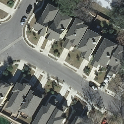
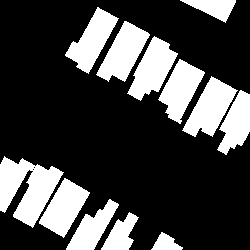

## Final Project Abstract

- In my project I aim to answer the question of whether we can use a U-Net Convolutional Neural Network in order to quantify urbanization from satellite images. A sub research goal is to use that neural network framework in order to identify and highlight buildings in an imagery scene. I intend on pulling satellite images from the [Inria Challenge Dataset](https://project.inria.fr/aerialimagelabeling/). Once I have the images, I plan on using the GDAL python package in order to cut the images into smaller 256 x 256 images. This is because the initial size of the dataset is 5000 x 5000 pixels, making it much too large to give to a model on its own. Once I have the split up images, I will run the images through the U-Net model that is pretrained from the Segmentation-Models python package. The backbone that I will use is the Resnet-34 and the weights that it was pretrained on will come from the [imagenet dataset](https://image-net.org/). I will then analyze the results of the model, comparing the produced labels with the true labels. Alongside the metrics of accuracy, this will provide an understanding of the validity of the produced model as well as an indication of if this method can be implemented on additional, unlabeled dataset. I plan on testing the final product on images from Harrisonburg, VA to see the outcomes. 

View my presentation on the model including results [here](mod5/data310_final_video.mp4)

### Example Image from the Dataset and the Mask

Image:

Mask:

