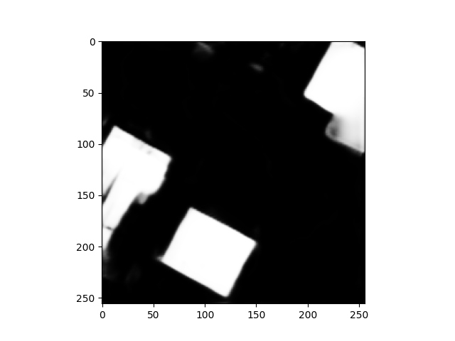
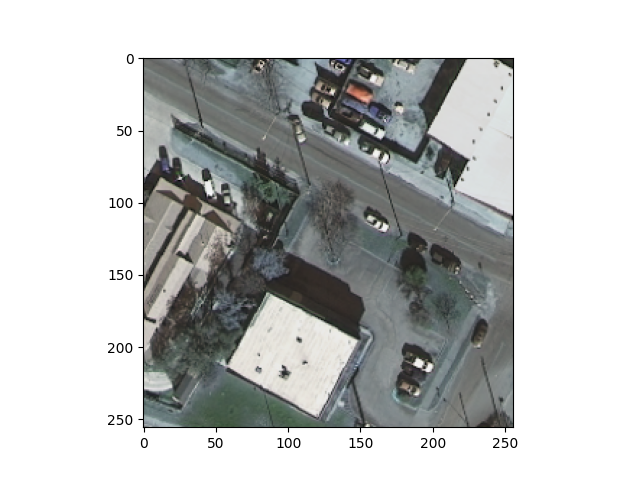
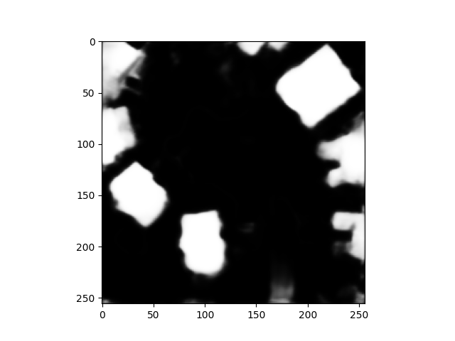
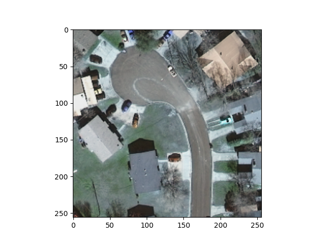
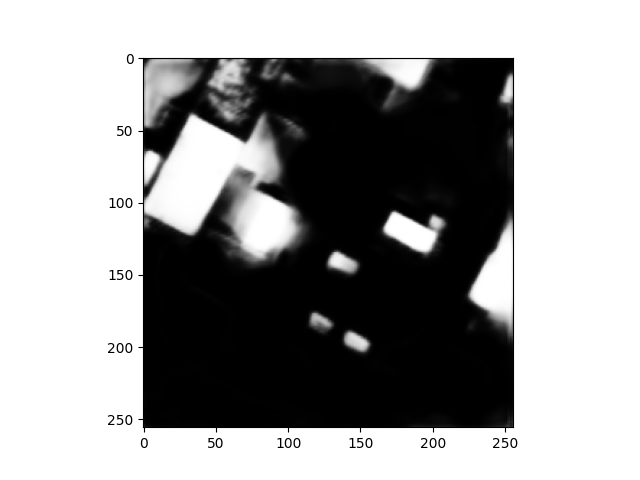
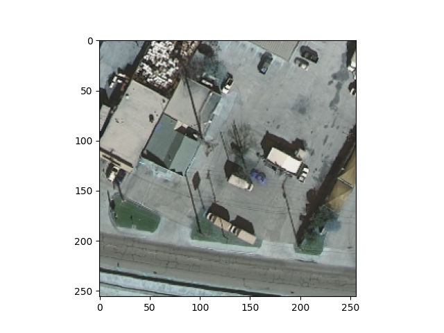

## Data Description and Preliminary Model

- The data I am using comes from the [Inria Challenge Dataset](https://project.inria.fr/aerialimagelabeling/). The data are a series of satellite images that contain the RGB value for each pixel. These pictures are 5000 x 5000 pixels. There are 36 images for Austin, Chicago, Kitsap, Tyrol, and Vienna. This results in a total of 180 5000 x 5000 images. The pixel values for these images is continuous from 0 to 255, where 0 is black and 255 is white. The data was collected from satellites and are of 0.3 meter resolution, making them very high resolution. The images are purposely from diverse areas to make it so that the model understands not just rural or urban environments. This leads to a more robust model. The labels for the model are the same sized images but black and white. The white areas represent where a building is present in the image. This is what is being used for the explicit building segmentation. 
- The model I am using is a pre-trained U-Net architecture from the Segmentation Models python package. The model has been pre-trained on the "imagenet" dataset for basic classification problems. This makes it so it has weights which are already mostly trained. What makes this model special is that you can then adjust these weights some more in order to make it fit your use-case more closely than just a general model. By being pre-trained, the computation time needed for acceptable results is much lower, allowing better models quicker. That is why I went with this implementation. The model has an exhaustive list of layers, too many to explicitly state at this juncture. However, I can relay some of the makings of it. There are a total of 24,456,154 parameters. There is RelU activation and sigmoid processing. Additionally, the loss function is Binary Cross Entropy because I changed all values of the masks grater than 0 to 1's. For a metric, I used "Accuracy" in order to see how many pixels the model was correctly predicting. 
- Below is my code which was heavily inspired from a [YouTube video here](https://www.youtube.com/watch?v=J_XSd_u_Yew&list=PLiHR3eIynOPrAg_1h0oFkArC_WO8bpRGA&index=9). My implementation was mostly simple. I first used the GDAL package in order to separate my images into 250 x 250 images so that they were easier to compute. The 5000 x 5000 was too large to run in the model. Once I was done splitting the images, I batched the images and masks into arrays using the glob python package and their directory. This allowed me to bring the images into the ide. I seperated the images and masks into training and testing data with an 80:20 split. Using the segmentation models package I preprocessed the images and masks independently. Once I defined the model, I fit it with the training data for 10 epochs with a batch size of 8. The model yielded an accuracy of 88% and produced the following images. As you can see, the model is currently effective at segmenting buildings but not perfect. At times it has trouble dealing with tree coverage. It does fail to have clear edges for some of the buildings but it provides a rough outline of where buildings appear. Additionally, the model sometimes classifies cars as buildings which is a potential flaw. I plan to train the model additionally and on additional images, hoping to produce some outputs for Harrisonburg images that don't have masks.  

##### Output --> Base Image:

