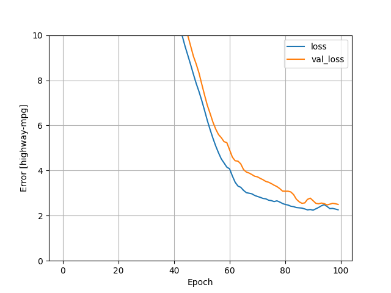
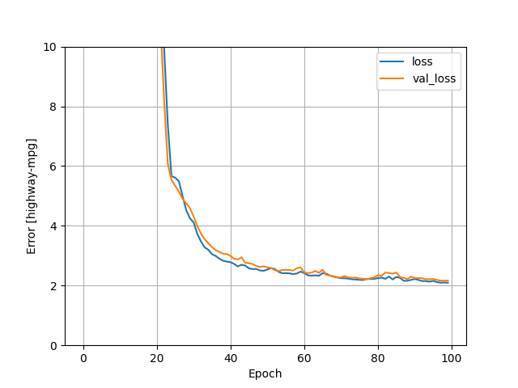
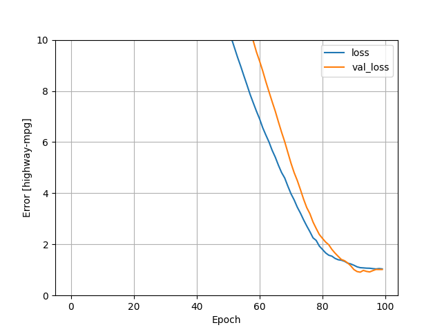
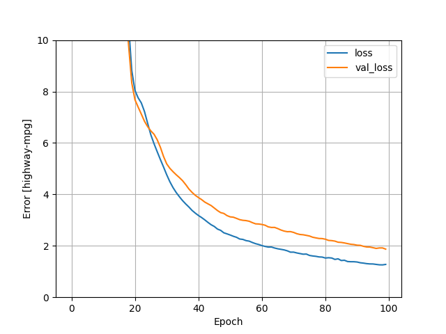

## Monday Response 7/12/21 
1. Which of the two models produces a better loss metric? 
    - The DNN model produced a better loss function than the linear model. The DNN model decrease more suddenly than the linear model. Overall, the DNN model had a 1.8 loss value while the linear model had a value of 2.1. 
    - Linear model loss function graph:
        
    - DNN Model loss function graph:
        
2. Adding additional features and analyzing the effect:
    - In addition to the original features, I added wheel-base, length, width, height, bore, stroke, compression, peak-rpm, and city-mpg. The addition of these features resulted in a better loss function for both models. Interestingly enough, the linear model had the better loss function than the DNN. The linear model had a final loss value of 1.05 while the DNN model finished with a loss value of 1.6. 
    - New Linear Model Loss Graph:
      
    - New DNN Model Loss Graph:
    
3. Best Possible Model
    - The best possible model that I was able to produce was the linear model with the additional features. This resulted in a model that had a loss value of 1.05. This was significantly better than the Linear or DNN on the original features, and also better than the DNN with the expanded features. The loss graph from above entitled "New Linear Model Loss Graph" visually shows the value of the model. 
