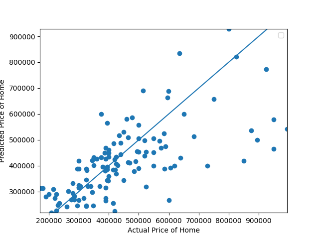
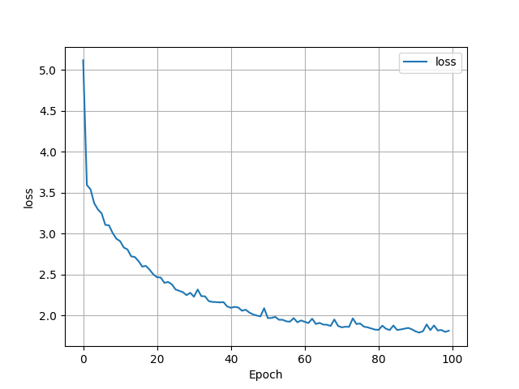

## Project 1 Response

1. How did your model fare?
    - The model I created seems to be relatively good at predicting house prices with the given variables. The MSE of the model is 1.87. The predictions all appear to follow an upward trend. When I first tried the model, it was much worse. Outlier houses in the millions made it so that the predictions would sometimes be negative. By removing these outlier houses, the trend is much clearer and more accurate, boding better results. They are still not fully accurate but seem to be somewhere within $100,000 of the real price which I would consider a success given my initial results. Furthermore, I would have done a train/test split but I feared this would decrease the training data too much, considering my sample size was already around 120 by removing outliers.  
      
      
2. In your estimation is there a particular variable that may improve model performance?
    - I would predict that including the relative location of a house would greatly increase the accuracy. There are certain locations in a city that would cost much more than other places, thus greatly impacting the expected price of the home. This could help the model better understand prices of the houses and thus have more accurate predictions. I would implement this by adding the specific zip code for each house. 
3. Which of the predictions were the most accurate? In which percentile do these most accurate predictions reside? Did your model trend towards over or under predicting home values?
    - The most accurate prediction was index 84 where the predicted price was $453439.57 while the actual price was $464900. The majority of correct/close to correct predictions were in the 25-50th percentile. Once the houses went over $600,000, the model became wildly inaccurate and unusable. This is most likely due to the trends of higher priced houses being much different than cheaper houses. The model tended to under predict the value of the houses.
4. Which feature appears to be the most significant predictor?
    - The most important feature for prediction appears to be the living area. This makes intuitive sense considering larger houses would most likely have more rooms and bathrooms, meaning those variables are slightly accounted for by the living area feature. As well, larger houses would be considered more expensive typically. Furthermore, removing living area from the input resulted in a much higher loss function than when bedroom and bathroom counts were removed. 
   
   
